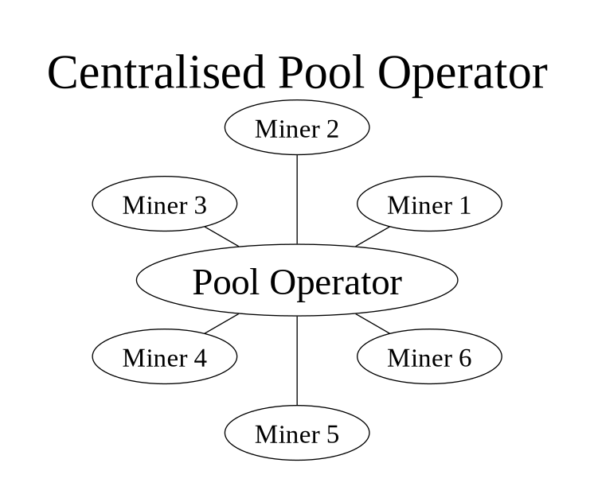
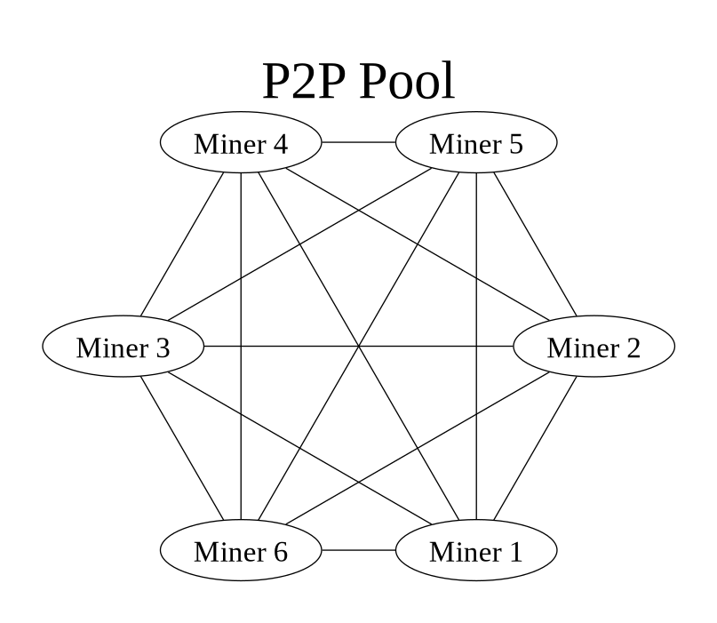
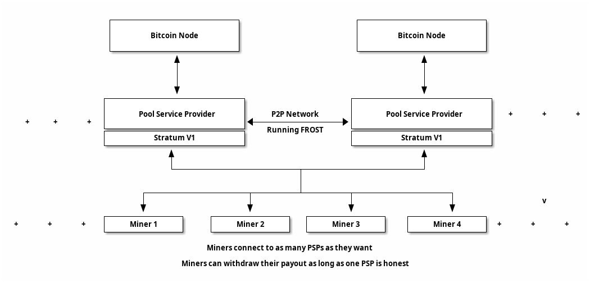

= Fedpool - Federated Mining Pool
Kulpreet Singh, @jungly
:toc:

Current mining pools provide no visibility to miners on the share
accounting or the fees charged by the pool. Further still, the current
pools are vulnerable to attacks where they are forced to follow
transaction selection rules. On the other hand, P2P pools like
Braidpool attempt to solve the transaction selection problem but their
use requires miners to run extra services. Some of these services are
not easy to boot up and maintain especially for the long tail of
miners. These long tail of miners are important to bitcoin for
resisting attacks on the larger mining operations.

In this document we present a mining pool solution that uses a
federation to replace the centralised pool operator. Federation
members generate block templates and provide stratum end points to
miners. Since federation tracks the shares from miners in an open P2P
network, anyone, including the miners can optionally validate the
share accounting and reward distribution to the miners.

We show a construction where the federation members distribute rewards
to miners in a way that miners can unilaterally exit from the pool
with their coins. We also show that federation members can not steal
miner's shares or reward.

== Problems with Centralised Pool

. Opaque share accounting.
. Centralised blocktemplate generation by single entity running the pool.
. Payouts can be blocked by pool operator.
. Smaller miners can be paying much larger fees than larger miners.

== Problem with P2P pools

. Miners need to run and maintain services along with their mining rigs.
. Payouts are under the control of a threshold, which can be hijacked by someone with a 51% hashrate.
. Running Threshold Signatures on a P2P model is still not solved.
  . The network model required by FROST needs nodes to be connected in
  a point to point network.

== Mining Federation as the Solution

image::../figures/fedpool.png[alt="Mining Syndicate/Federation",width="50%"]

Mining syndicate resists mining centralisation by breaking up the
centralised pool into a federation. The members of the federation
build blocktemplates, enable miner payouts, and help reduce variance
for miners.

There are two types of parties in the system.

. Miners - these run mining facilities and do not need to run bitcoin node or a fedpool node.
. Federation members - these run bitcoin nodes, generate block templates and sign miner payout transactions using threshold signatures.

Miners register with a federation members and communicate with the
federation using stratum mining protocol. Federation members take on
the complexity in this design, allowing miners to switch from
centralised pools without running any services. Here's a list of
responsibilities the federation members take on:

. Build block templates.
. Run services to let miners register with them.
. Run stratum servers that miners use to generate shares.
. Run consistent share accounting by using state replication across the members.
. Sign miner payout transactions using Schnorr threshold signatures.

The coinbase and payout transaction are constructed such that neither
the miner nor any federation member can steal coins or prevent the
mining federation from making progress.

== System Overview

The diagarm below shows how the miners and federation members
communicate. Note, there is no peer to peer communication between
miners. Only the federation members use p2p communication for
consistent state replication and reaching byzantine fault tolerant
agreement.

Miners register with any federation member, and then communicate with
the federation member's stratum instance. The federation member signs
the shares it receives from the miner before broadcasting them to the
rest of the federation. This helps in identifying the federation
members that are serving each of the miners. We will see later why
this becomes important when it comes to fee distribution among the
federation members.

=== Federation Operation

The federation members run all the services that currently centralised
pool operators need to run. The difference is the the federation is
transparent and all members verify correct operations of all other
members. Furthermore, federation membership is open and members can
join and leave the federation using the FOSS implementation of our
federation node.

The joining part is permissioned and if a federation has reached a
point it can't scale further, it will start rejecting join requests
from entities who want to join the federation. Entities can start new
federations once they can attract enough hashrate. On the other hand,
the capital requirements that we explain below will encourage a
federation to grow as much as it can to support a large hashrate pool
and thus a pool with reduced variance.

[INFO]
====
We provide the tools, people run the federations!
====

.Federation Member Responsibilites
. Run a federation node and a bitcoin node to handle share validation at scale.
. Run stratum interfaces for miner interaction.
. Provide a miner registration interface.
. Generate block templates and stratum work messages.
. Receive shares over stratum protocol and maintain a database of received shares.
. Contribute capital used to pay miners.
. Provide interfaces for miners to check their balances and collect their earnings.

==== Capital Requirements and Risks Mitigation

The capital required to fund the pool is distributed across the
federation members reducing the capital risks for any individual
federation member.

When a new member wants to join a federation, the existing members
will see reduced earnings. The federation is incentivized to grow as a
larger federation can manage payouts for larger number of miners and
thus can provide reduced variance for all miners and thus attract more
miners. This flywheel effect is important for any federation to try
and achieve, for which expanding the size of the federation is
important.

[INFO]
====
TODO: Capital calculation.
====

==== Transparent and Open Operations

A mining federation results in a transparent pool where all federation
members validate all other federation members are working correctly. If
a member is not working according to the agreed upon protocols, the
honest federation members stop rewarding the dishonest member and will
eventually remove the dishonest member from the federation.

The above is made possible by point to point communication between
federation members as well as the bitcoin contracts between the
federation members.

// [plantuml, target=frost-overview]
// ....
// @startuml
// !include https://raw.githubusercontent.com/plantuml-stdlib/C4-PlantUML/master/C4_Dynamic.puml

// Container(new_member, "New Member", "Potential Federation member")
// System_Boundary(federation, "Federation") {
//     Container(federation_a, "Member A", "Federation member")
//     Container(federation_b, "Member B", "Federation member")
//     Container(federation_c, "Member C", "Federation member")
// }    

// Rel_D(new_member, federation_a, "Request to Join with capital offered", "Confidential channel")

// Rel(federation_a, federation_b, "Forward join request", "Confidential channel")
// Rel(federation_a, federation_c, "Forward join request", "Confidential channel")

// Rel(federation_a, federation_b, "Run FROST protocol", "Confidential channel")
// Rel(federation_a, federation_b, "Run FROST protocol", "Confidential channel")
// Rel(federation_b, federation_c, "Run FROST Protocol", "Confidential channel")

// @enduml
// ....

== Resisting Sybil Attacks

When a miner sends their share to a federation member, the member
signs the shares before broadcasting to the entire federation. This
identifies shares with the federation members that brought the
hashrate to the pool. The figure below shows how this works.

To prevent anyone from joining the federation by bringing in capital,
we require that federation members also bring in hashrate to the
pool. Further, to resist sybil attacks by anyone joining the
federation, we limit the threshold participation to the members that
bring the top 2/3rds of the hashrate.

== Comparison With Centralised Pools

.Pros
. Diversity of block templates - Each federation member is free to choose set of transactions in a block, the only requirement is that the coinbase conforms to the requirements of fedpool contracts.
. Transparent share accounting - miners can validate their payouts are correct.
  . Miners (or anyone) can access the pool's data by joining the
  federation's P2P network.
. Transparent fee schedule - all miners can validate they are being charged a fair fee rate.
. Resilience - as long a threshold number of members are reachable, the federation can continue to make progress.

.Cons
. Fedpool uses PPLNS instead of FPPS which is quite popular with centralised pools despite all the drawbacks.

== Comparison With P2P Pools

.Pros
. Zero friction to switch from centralised pools. The process is the same as changing from one centralised pool to another.
. Miners don't need to run any servers or run any validation - unless they want to.
. No need for p2p communication between miners - scalability of the pool depends only on the ability to scale the federation p2p communication, which is a tractable challenge.
. No consensus required between miners on the state of shares generated.

.Cons
. Block template generation is managed by federation members.
  . However, anyone can join the federation and provide block
  templates, including miners themselves.

== Using Bitcoin For Federation Group Membership

Group membership has a reduction to consensus. In our trust model, we
require this consensus to have byzantine fault tolerant
properties. This makes it hard to track who are the current members of
the federation. To solve the problem, we turn to using Bitcoin
consensus for maintaining the federation membership.

Federation members provide inputs into a membership transaction. The
outputs of the membership transaction require the federation threshold
signature to spend and carry a dust amount. The outputs of the
membership transaction are used as inputs into funding transactions
that manage the payouts made to miners.

By requiring a bitcoin transaction to be confirmed and have certain
minimum confirmations, we solve the federation's membership problem
using bitcoin's BFT consensus.

== Coinbase, Blocktemplates and Payouts

The key component that validates the proposal is how coinbases and
blocktemplates are constructed by federation members and how payouts
are made to miners.

.Payout sub-system requirements
. Miners should be able to exit the pool unilaterally with all their coins, without requiring any permission from the federation or anyone else.
. Federation should be able to make progress as long as threshold number of members are honest.
. Miners should receive payout for all their shares using PPLNS reward distribution.
. Federation members should not be able to steal miners shares.
. Miners work on a block only if they know their fair share of payout is included in the coinbase.

== Federation Protocols

The federation and miners follow a number of separate protocols to
enable the system to work together.

=== Initial Setup

To start a new federation, any member announces their network
address. The threshold and federation size is set to one.

Miners that want to join the federation initiate their registration
with sole federation member and set their stratum end point to the
federation member.

.New federation with single member
[plantuml, target=intial-setup]
....
@startuml
Miner --> FederationMember: Register
FederationMember --> Miner: Auth token
Miner <--> FederationMember: Stratum auth, notify, submit
"Miner/Validtor" <-- FederationMember: Share broadcasts
@enduml
....

At this point, the sole federation member acts like a centralised pool
operator, with transparent share accounting.

=== New Federation Member

To join the federation, a new member has to lock in capital in to a
bitcoin transaction signed by the Federation using a Schnorr threshold
signautre. A successfully signed transaction signifes that a threshold
of the existing federation member agree to the new member joining.

The only criterion available for the existing federation members is the
amount of new capital the new member is bringing to the federation.

Each federation can decide the policies they want to adopt for
admitting new members by agreeing on the minimum and maximum bitcoin
that each member locks into the federation. This value is agreed out of
band and configured at federation start up time.

.New federation member
[plantuml, target=intial-setup]
....
@startuml
NewFederationMember --> ExistingMember: Join Request
ExistingMember <--> Federation: Reliable broadcast of Join Request
ExistingMember --> NewFederationMember: New funding tx (unsigned)
NewFederationMember --> ExistingMember: Partially signed funding tx
NewFederationMember <--> Federation: Run FROST to sign new tx
@enduml
....

=== Federation Member Exit

Similar to the protocol followed to add a new member to the federation,
the federation members create a new transaction with updated
balances. The member leaving the federation is part of the party that
runs the threshold signature instance to sign the input spending the
previous federation output.

=== Federation Member Failures

If a member fails (say is unresponsive), the federation continues to
operate as normal. If more than a threshold number of federation
members fail, the pool reaches end of life and all federation members
along with miners can claim their outputs after the timeout expiry.

See section on Bitcoin Contracts to see how the transactions are
structured.

=== New Miner Registration

A miner register with any of the federation members by following the
protocol to create a new authentication token. This can follow any of
the well known protocols like OAuth. The miner submits a public key to
which it should receive payouts.

A miner can obtain a similar authentication token from multiple
federation members. The miner should use the same public key to
register with multiple federation members.

Using this authentication token, the miner can open a communication
channel to send and receive stratum messages to the federation members.

At the end of the miner registration, the miner is in a position to
start sending shares to the federation.

.New Miner Registration
[plantuml, target=intial-setup]
....
@startuml

group Federation Member 1
NewMiner --> FederationMember_1: Register using HTTP API
NewMiner <-- FederationMember_1: Auth token 1
NewMiner --> FederationMember_1: Submit public key

NewMiner <--> FederationMember_1: Stratum communication
end

group Federation Member 2
NewMiner --> FederationMember_2: Register using HTTP API
NewMiner <-- FederationMember_2: Auth token 2
NewMiner --> FederationMember_2: Submit public key

NewMiner <--> FederationMember_2: Stratum communication
end
@enduml
....

.Funding Transaction
[plantuml, target=funding-tx]
....
@startuml
object Foo
map Bar {
  abc=>
  def=>
}
object Baz

Bar::abc --> Baz : Label one
Foo --> Bar::def : Label two
@enduml
....

=== Submit Shares to Federation: Stratum

The miner signs the shares it submits to the federation members. Miners
will use a proxy for signing their shares. The shares are signed by
using the same public key that the miner registered for receiving
payouts.

TIP: The signing of shares and using the proxy is optional.

If the miner does not sign the shares, then it is trusting the
federation member to not steal their shares. However, if the federation
member steals the shares the miners can observe this by subscribing to
the federation p2p broadcast that replicates shares across the
federation and observing all the shares the federation is receiving.

=== Federation Network

The federation members open a point to point to connection with all
other federation members. This channels is authenticated and
confidential.

Each federation member sends the following messages to all other
federation members:

. New block template it is working on
. The stratum job it sends to miners
. All shares received from all miners
. Requests by new federation members
. Miner public key once it is registered with the federation member
. Requests received from miners to leave the pool

The messages above will result in subsantial amount of network
traffic. The federation members also validate all the shares received
from other federation members.

The replication of shares on all federation members is important
because this transparent share accounting enables all the miners to
calculate the payout distribution and validate any new payout and
coinbase transactions before signing the federation update transaction.

=== Share Replication and Accounting

Once a miner starts sending shares to a federation member, the shares
are replicated to the other federation members. A federation member that
receives shares, verifies the shares before broadcasting it to the
rest of the federation.

A miner can send their shares to multiple federations by registering
with the federation.

=== Blocktemplate Generation
=== Payout Mechanism
=== Miner Exit
